# SecurityJava — Cryptography & Security Curriculum

A hands-on Java 21 codebase for learning cryptography and security from the ground up.
Every class is standalone and runnable. Follow the learning path below — each topic builds on the previous one.

---

## How to Run Any Example

```bash
mvn exec:java -Dexec.mainClass="security.<package>.<ClassName>"
```

**Example:**
```bash
mvn exec:java -Dexec.mainClass="security.mac.HMACExample"
```

---

## Learning Path

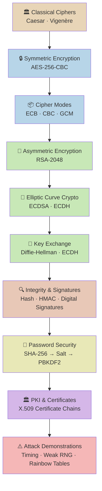

---

## Package Map & Detailed READMEs

Each package has its own `README.md` with rendered Mermaid diagrams and concept explanations.

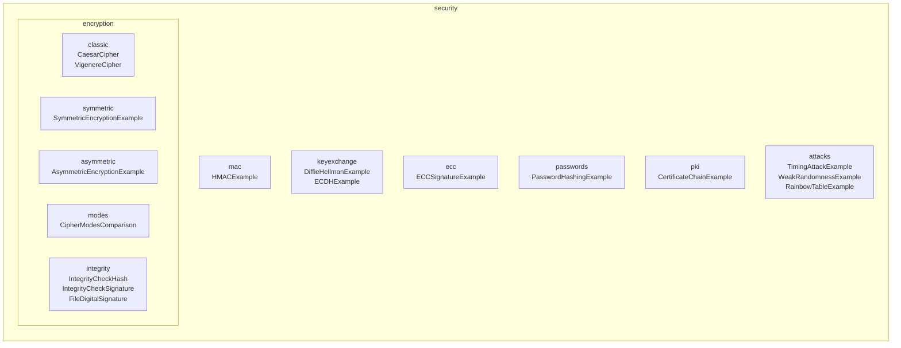

### Package README Index

| Package | README | What it covers |
|---|---|---|
| `security.encryption.classic` | [📖 classic/README.md](src/main/java/security/encryption/classic/README.md) | Caesar cipher shift & brute force · Vigenère keyword repeating & Kasiski attack |
| `security.encryption.symmetric` | [📖 symmetric/README.md](src/main/java/security/encryption/symmetric/README.md) | AES-256-CBC · IV facts · CBC block chaining diagram |
| `security.encryption.asymmetric` | [📖 asymmetric/README.md](src/main/java/security/encryption/asymmetric/README.md) | RSA-2048 key generation · encrypt/decrypt flow · hybrid encryption |
| `security.encryption.modes` | [📖 modes/README.md](src/main/java/security/encryption/modes/README.md) | ECB pattern leak · CBC chaining · GCM authenticated encryption |
| `security.encryption.integrity` | [📖 integrity/README.md](src/main/java/security/encryption/integrity/README.md) | SHA-256 avalanche effect · RSA signatures · file signing & tamper detection |
| `security.mac` | [📖 mac/README.md](src/main/java/security/mac/README.md) | HMAC-SHA256 construction · hash vs HMAC vs signature · constant-time comparison |
| `security.keyexchange` | [📖 keyexchange/README.md](src/main/java/security/keyexchange/README.md) | Diffie-Hellman protocol · discrete log problem · ECDH · forward secrecy |
| `security.passwords` | [📖 passwords/README.md](src/main/java/security/passwords/README.md) | SHA-256 → salted → PBKDF2 · cracking speeds · login verification flow |
| `security.ecc` | [📖 ecc/README.md](src/main/java/security/ecc/README.md) | ECDSA sign/verify · RSA vs ECC key sizes · real-world uses |
| `security.attacks` | [📖 attacks/README.md](src/main/java/security/attacks/README.md) | Timing attack · weak PRNG · rainbow table attack & salt defence |
| `security.pki` | [📖 pki/README.md](src/main/java/security/pki/README.md) | X.509 chain of trust · browser validation · TLS handshake |

---

## 1. Classical Ciphers — `security.encryption.classic`

> **The foundations.** Before computers, people encrypted messages by hand using substitution rules. These are broken, but they teach the core vocabulary: plaintext, ciphertext, key, and attacks.

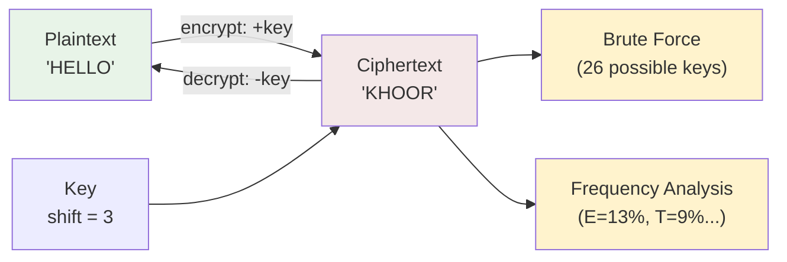

| File | Key concepts |
|---|---|
| `CaesarCipher.java` | Substitution cipher, brute-force attack (26 tries), frequency analysis |
| `VigenereCipher.java` | Polyalphabetic cipher, Kasiski examination, index of coincidence |

**Why it matters:** Shows that security-through-obscurity fails. Even a complex-looking cipher can be broken if it has a small key space or exploitable patterns.

---

## 2. Symmetric Encryption — `security.encryption.symmetric`

> **One key, two directions.** The same secret key encrypts and decrypts. Fast enough for bulk data, but the key must be shared securely in advance.

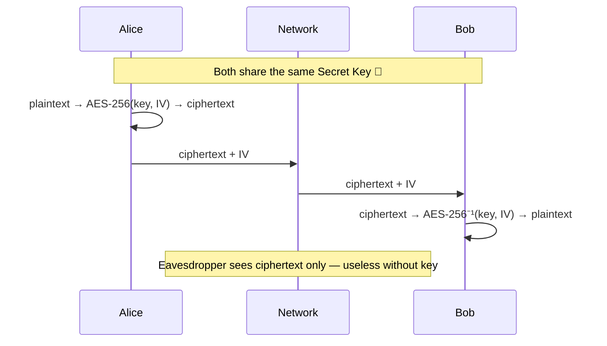

| File | Key concepts |
|---|---|
| `SymmetricEncryptionExample.java` | AES-256-CBC, key generation, IV (Initialization Vector), Base64 encoding |

**Key insight:** The IV must be unique per encryption but does not need to be secret. The key must never be transmitted over an insecure channel — that's solved by key exchange (see §6).

---

## 3. Cipher Block Modes — `security.encryption.modes`

> **Same algorithm, very different security.** AES encrypts 16 bytes at a time. The *mode* determines how blocks are connected. The wrong mode leaks structure even when each block is encrypted.

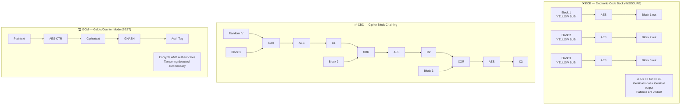

| File | Key concepts |
|---|---|
| `CipherModesComparison.java` | ECB pattern leak, CBC IV chaining, GCM authenticated encryption, `AEADBadTagException` on tamper |

**Key insight:** Always prefer AES-GCM for new code. It gives you encryption + integrity in one step, with no extra HMAC required.

---

## 4. Asymmetric Encryption — `security.encryption.asymmetric`

> **Two keys, one pair.** A public key encrypts; only the matching private key can decrypt. Solves the key distribution problem — share your public key with the world.

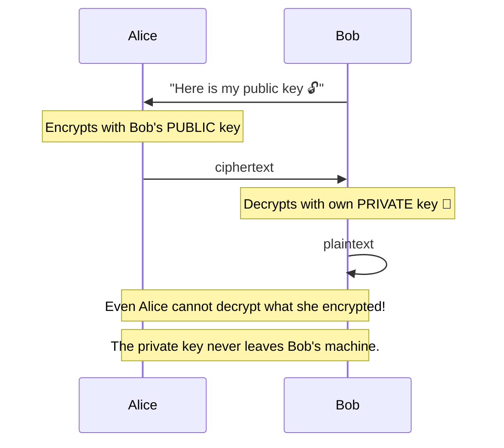

| File | Key concepts |
|---|---|
| `AsymmetricEncryptionExample.java` | RSA-2048, public/private key pair, key pair generation, OAEP padding |

**Key insight:** RSA is too slow for bulk data. In practice (TLS, Signal), asymmetric crypto is used only to establish a shared symmetric key, then AES takes over.

---

## 5. Integrity & Digital Signatures — `security.encryption.integrity`

> **Proving data hasn't changed — and who sent it.** Hashes verify integrity. Digital signatures add authentication: only the holder of the private key could have produced the signature.

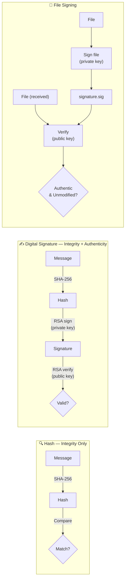

| File | Key concepts |
|---|---|
| `IntegrityCheckHash.java` | SHA-256, avalanche effect, integrity without authentication |
| `IntegrityCheckSignature.java` | RSA signing, SHA256withRSA, public key verification |
| `FileDigitalSignature.java` | Signing files to disk, detached signatures, tamper detection |

**Key insight:** A hash proves a file hasn't changed *in transit*. A signature proves *who* signed it and that it hasn't changed. HMAC sits in between — authenticated, but requires a shared key.

---

## 6. Key Exchange — `security.keyexchange`

> **The magic trick.** Alice and Bob agree on a shared secret over a channel where Eve hears everything — without ever transmitting the secret. This solves the fundamental problem of symmetric encryption.

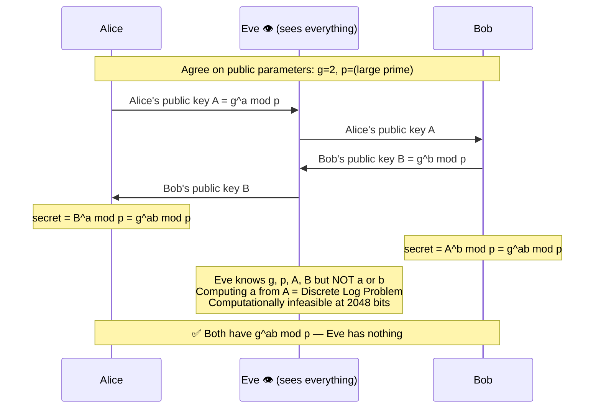

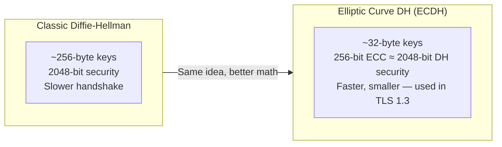

| File | Key concepts |
|---|---|
| `DiffieHellmanExample.java` | Classic DH, public parameters, discrete log problem, MITM vulnerability |
| `ECDHExample.java` | Elliptic curve DH, P-256 curve, forward secrecy, key size comparison |

**Key insight:** ECDH is what TLS 1.3 uses for every HTTPS connection. A fresh key pair is generated per session (Ephemeral ECDH = ECDHE) so past sessions stay private even if a long-term key leaks.

---

## 7. HMAC — `security.mac`

> **A hash with a secret key.** A plain hash can be recomputed by anyone. HMAC requires the secret key — proving both integrity and that the sender holds the key.

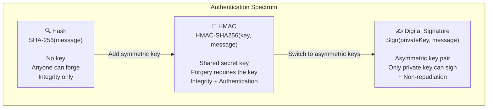

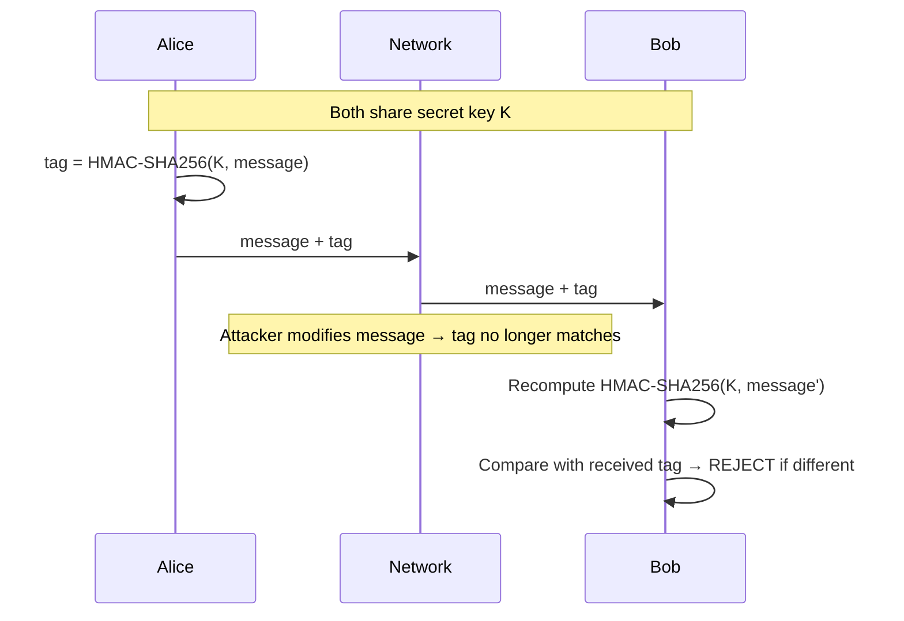

| File | Key concepts |
|---|---|
| `HMACExample.java` | HMAC-SHA256, constant-time verification, hash vs HMAC vs signature |

**Key insight:** Use HMAC when you and the other party share a secret key (e.g., API authentication, JWT with HS256). Use digital signatures when the receiver must not be able to forge the proof (e.g., TLS certificates).

---

## 8. Password Security — `security.passwords`

> **Why you can't just hash passwords.** Passwords need to be stored so you can verify them at login — but never retrievable. The solution has evolved from plain hashes to deliberately slow, salted algorithms.

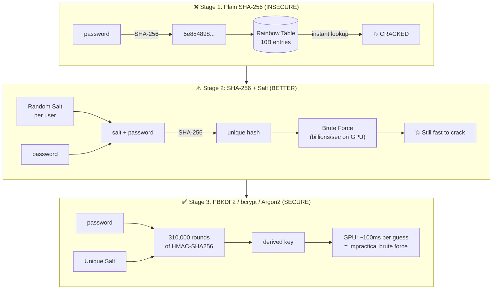

| File | Key concepts |
|---|---|
| `PasswordHashingExample.java` | Plain SHA-256, salted SHA-256, PBKDF2 (310k iterations), simulated login |

**Key insight:** Passwords need *slow* hashing. SHA-256 runs at billions of iterations per second on a GPU; PBKDF2 with 310,000 rounds takes ~100ms per guess — a factor of ~10⁸ harder to brute force.

---

## 9. Elliptic Curve Cryptography — `security.ecc`

> **Smaller keys, same security.** ECC is an alternative mathematical foundation for public-key cryptography. The same operations (signing, key exchange) work with dramatically smaller keys.

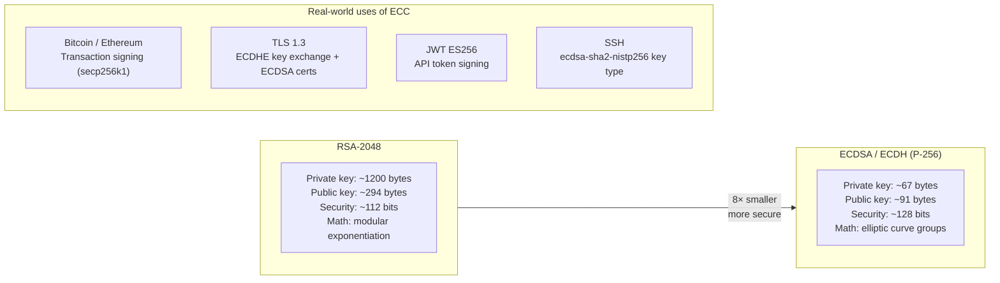

| File | Key concepts |
|---|---|
| `ECCSignatureExample.java` | ECDSA P-256, sign/verify, RSA vs ECC key size comparison |

**Key insight:** ECC is not fundamentally different from RSA in what it achieves — it achieves the *same* things with smaller keys because the underlying hard problem (elliptic curve discrete log) is harder per bit than RSA's integer factorisation.

---

## 10. PKI & Certificates — `security.pki`

> **The chain of trust behind HTTPS.** Public keys solve the *distribution* problem but not the *authenticity* problem: how do you know a public key actually belongs to `example.com`? Certificate Authorities provide the answer.

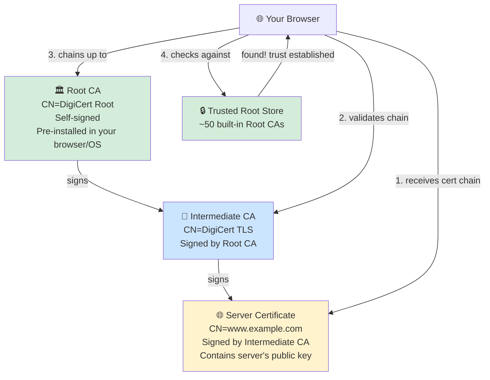

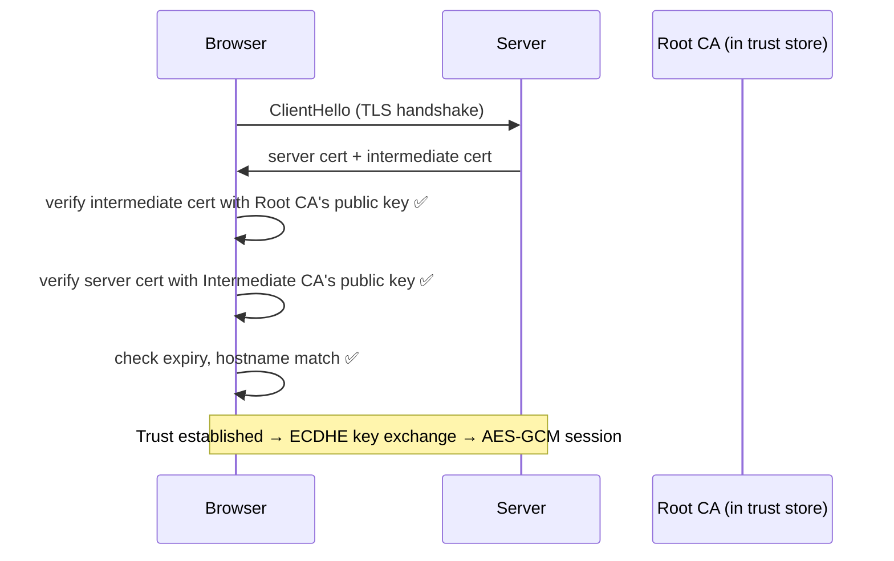

| File | Key concepts |
|---|---|
| `CertificateChainExample.java` | X.509 certificates (BouncyCastle), Root CA, Intermediate CA, end-entity cert, chain validation |

**Key insight:** The Root CA never signs website certs directly. The offline Root CA signs Intermediate CAs; those sign sites. If an Intermediate CA is compromised, the Root CA can revoke it without replacing the Root.

---

## 11. Attack Demonstrations — `security.attacks`

> **Understanding attacks makes you a better defender.** These examples show how real vulnerabilities work so you can recognize and avoid them in your own code.

### Timing Attack

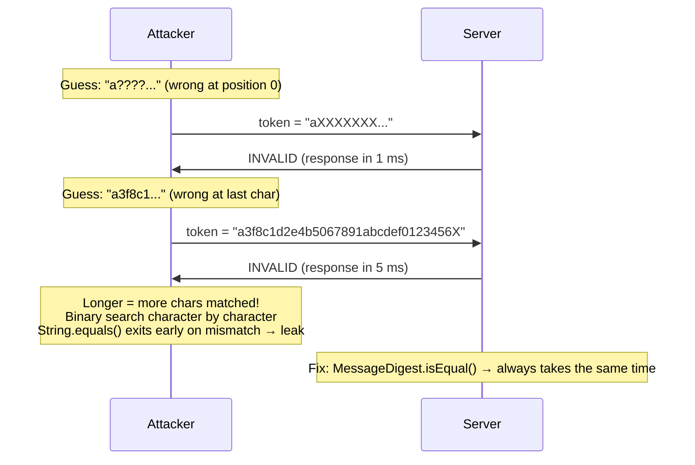

### Weak Randomness

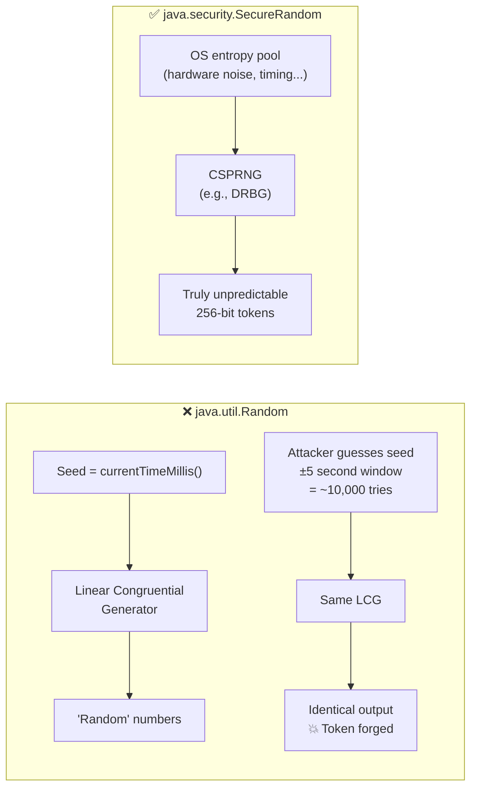

### Rainbow Table Attack

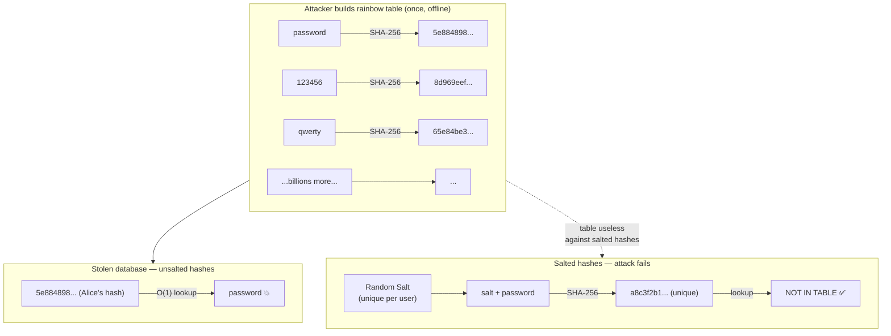

| File | Key concepts |
|---|---|
| `TimingAttackExample.java` | Early-exit string comparison, `MessageDigest.isEqual()` constant-time fix |
| `WeakRandomnessExample.java` | `java.util.Random` seed prediction, `SecureRandom` entropy pool |
| `RainbowTableExample.java` | Precomputed lookup tables, salt defeats precomputation |

---

## Security Properties Quick Reference

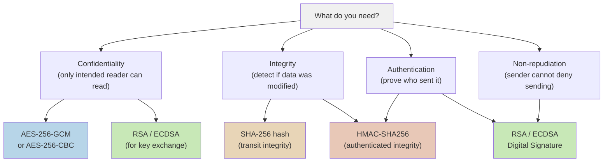

## Key Size Cheat Sheet

| Algorithm | Key size | Security level | Use for |
|---|---|---|---|
| AES | 128-bit | ✅ Good | Symmetric encryption |
| AES | 256-bit | ✅✅ Better | Symmetric encryption |
| RSA | 2048-bit | ✅ Minimum | Asymmetric (legacy) |
| RSA | 4096-bit | ✅✅ Strong | Asymmetric (high-value) |
| EC (P-256) | 256-bit | ✅✅ Strong | ECC — equiv. to RSA-3072 |
| EC (P-384) | 384-bit | ✅✅✅ Very strong | ECC — equiv. to RSA-7680 |
| HMAC-SHA256 | 256-bit | ✅✅ Strong | Authentication |
| PBKDF2-SHA256 | 310k+ iterations | ✅✅ Strong | Password hashing |

## Common Mistakes to Avoid

| ❌ Don't | ✅ Do instead |
|---|---|
| `new Random()` for keys/tokens | `new SecureRandom()` |
| `token.equals(stored)` | `MessageDigest.isEqual(a, b)` |
| AES/ECB mode | AES/GCM/NoPadding |
| `SHA-256(password)` for storage | PBKDF2 / bcrypt / Argon2 |
| Store passwords in plain text | Store `(salt, iterations, hash)` |
| Same IV for every AES encryption | Fresh random IV per encryption |
| MD5 or SHA-1 for integrity | SHA-256 or SHA-3 |
| RSA direct encryption of large data | AES for data, RSA for the AES key |

---

## Dependencies

- **Java 21**
- **BouncyCastle `bcprov-jdk15on:1.68`** — core crypto provider (ECC, extended algorithms)
- **BouncyCastle `bcpkix-jdk15on:1.68`** — PKI / X.509 certificate utilities
