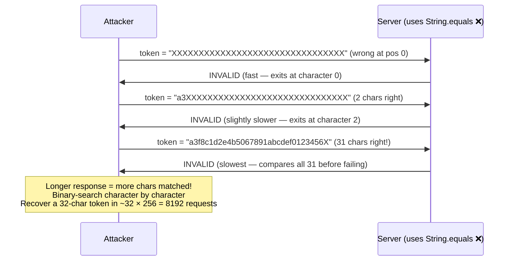
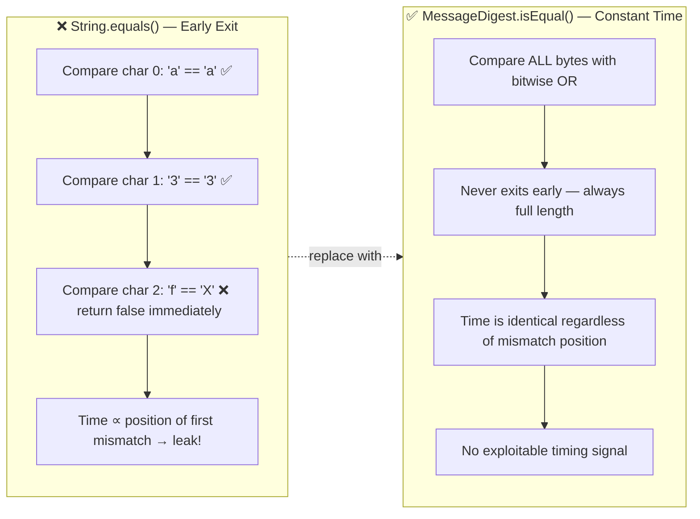
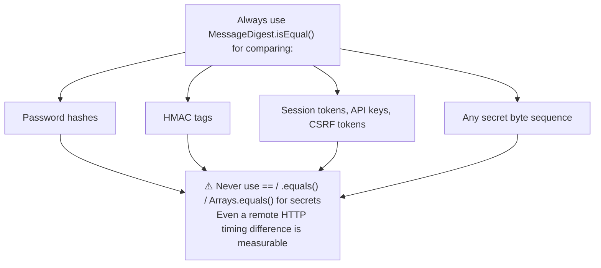
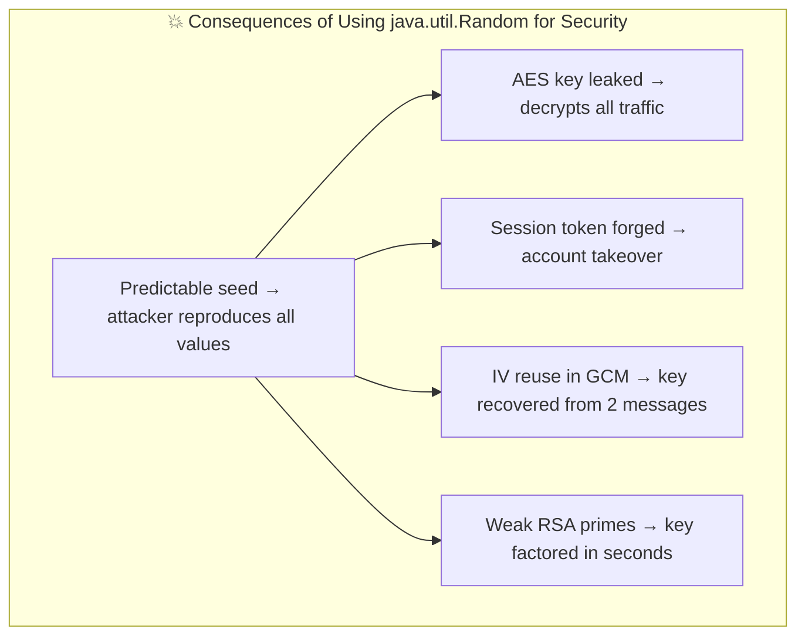
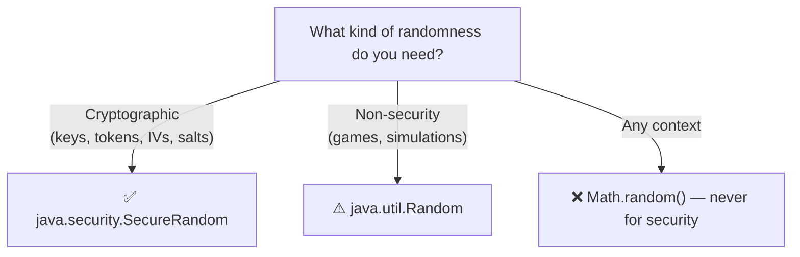
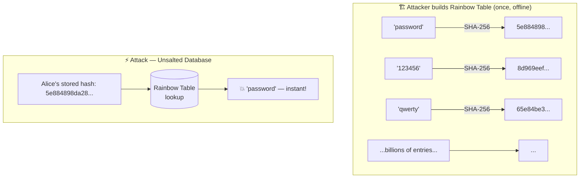
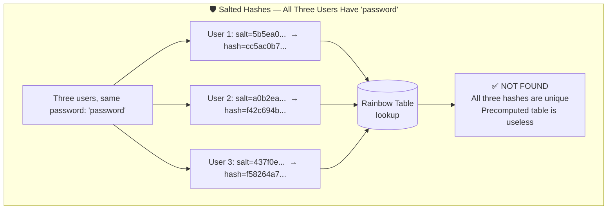
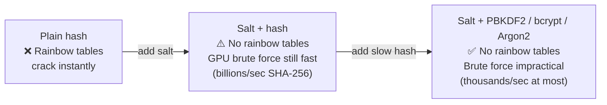

# Attack Demonstrations

Understanding attacks makes you a better defender. These classes show three common vulnerabilities so you can recognise and avoid them in your own code.

Run with:
```bash
mvn exec:java -Dexec.mainClass="security.attacks.TimingAttackExample"
mvn exec:java -Dexec.mainClass="security.attacks.WeakRandomnessExample"
mvn exec:java -Dexec.mainClass="security.attacks.RainbowTableExample"
```

---

## TimingAttackExample.java

A **timing attack** extracts secrets by measuring how long an operation takes. `String.equals()` returns false the moment it finds a mismatch — earlier mismatch = faster return = information leak.

### How the Attack Works



### Vulnerable vs Secure Comparison



### The Rule



---

## WeakRandomnessExample.java

Cryptography depends on **unpredictability**. `java.util.Random` is seeded from the clock — if an attacker knows roughly when a token was generated, they can reproduce every value it produced.

### Weak PRNG vs CSPRNG

```mermaid
flowchart TD
    subgraph Weak ["❌ java.util.Random — Predictable"]
        SEED["Seed = System.currentTimeMillis()<br/>(attacker can guess: ±5 sec = ~10,000 tries)"]
        LCG["Linear Congruential Generator<br/>next = (a × current + c) mod m<br/>Fully deterministic formula"]
        OUT["Output: 2423, 9550, 6394, ..."]
        SEED --> LCG --> OUT
        OUT --> ATKSEED["Attacker tries all seeds in the window"] --> ATKOUT["Reproduces exact sequence 💥"]
    end

    subgraph Strong ["✅ java.security.SecureRandom — Unpredictable"]
        ENTROPY["OS Entropy Pool<br/>• CPU timing jitter<br/>• Hardware RNG<br/>• Network packet timings<br/>• Disk I/O timing"]
        DRBG["CSPRNG (DRBG)<br/>Cryptographically Secure<br/>Pseudo-Random Number Generator"]
        SOUT["Output: computationally<br/>indistinguishable from true random"]
        ENTROPY --> DRBG --> SOUT
    end
```



### What Breaks with Weak Randomness



### When to Use Which



---

## RainbowTableExample.java

A **rainbow table** is a precomputed lookup: `hash → password`. An attacker who steals a database of unsalted hashes can crack every recognisable password in seconds. A unique random salt per user destroys this attack.

### Building and Using a Rainbow Table



### Salt Defeats the Attack



### Defence in Depth


