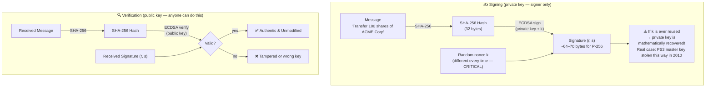
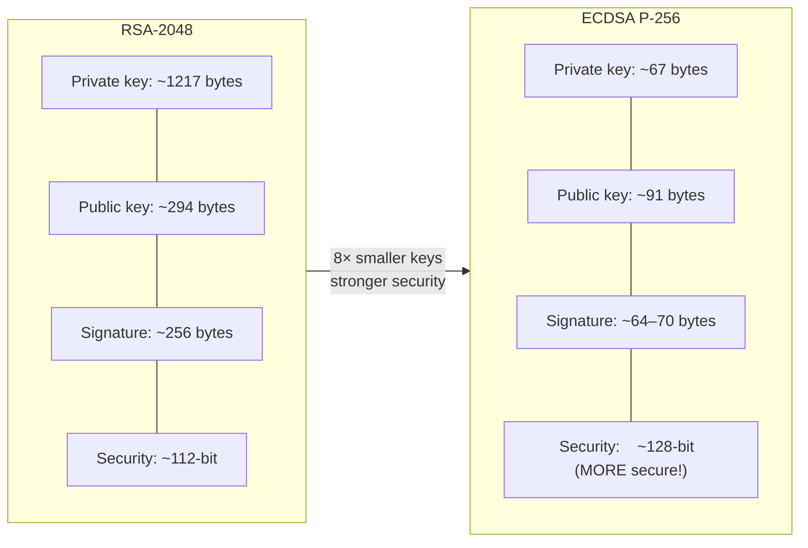
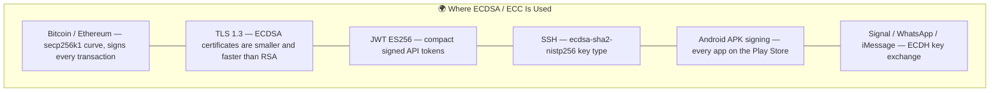
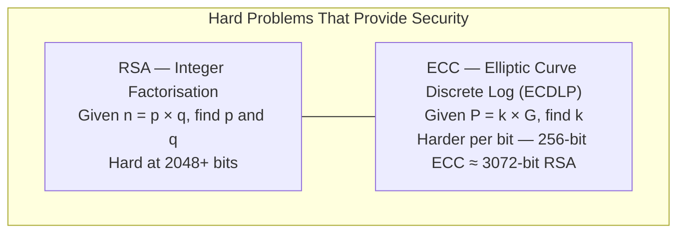

# Elliptic Curve Cryptography — ECDSA

Same goals as RSA (signing, key exchange) but using elliptic curve mathematics instead of integer factorisation. The payoff: dramatically smaller keys for equivalent or better security.

Run with:
```bash
mvn exec:java -Dexec.mainClass="security.ecc.ECCSignatureExample"
```

---

## ECCSignatureExample.java

### Sign and Verify Flow



### RSA vs ECDSA Key Size Comparison



### Real-World Uses



### ECC vs RSA — The Core Difference


