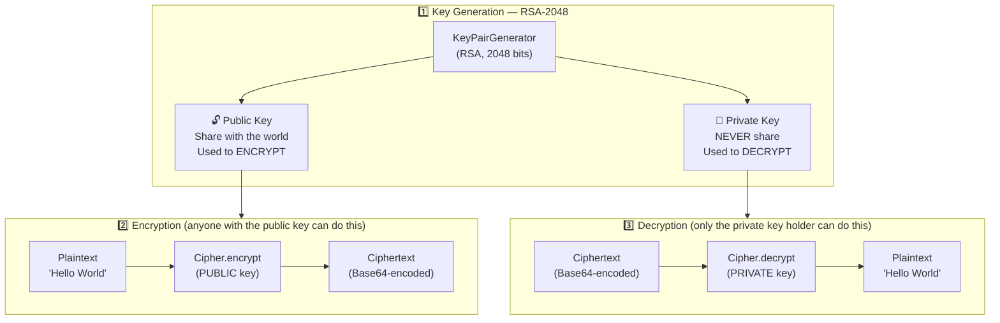
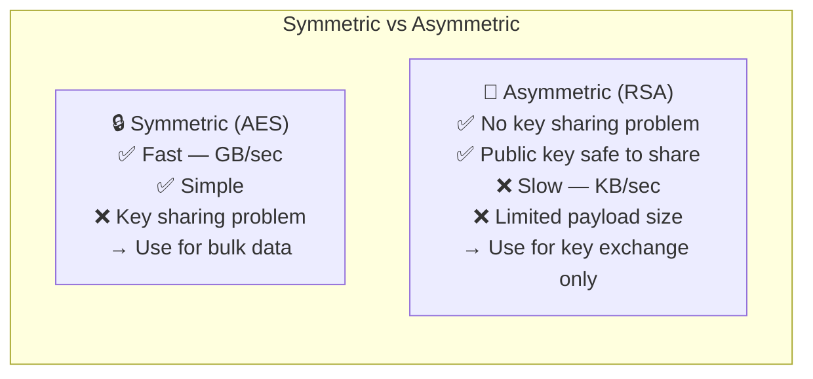
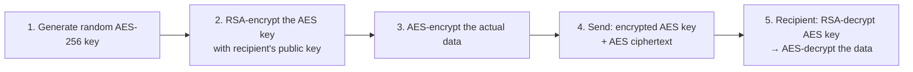

# Asymmetric Encryption — RSA-2048

Two mathematically linked keys: a public key that anyone can use to encrypt, and a private key that only the owner can use to decrypt. Solves the key distribution problem of symmetric encryption.

Run with:
```bash
mvn exec:java -Dexec.mainClass="security.encryption.asymmetric.AsymmetricEncryptionExample"
```

---

## AsymmetricEncryptionExample.java

### Key Generation and Encryption Flow



### Symmetric vs Asymmetric



### How They Work Together — Hybrid Encryption

In practice (TLS, PGP, Signal), RSA and AES are always combined:



> RSA handles the key exchange problem. AES handles the speed problem. Together they solve both.
