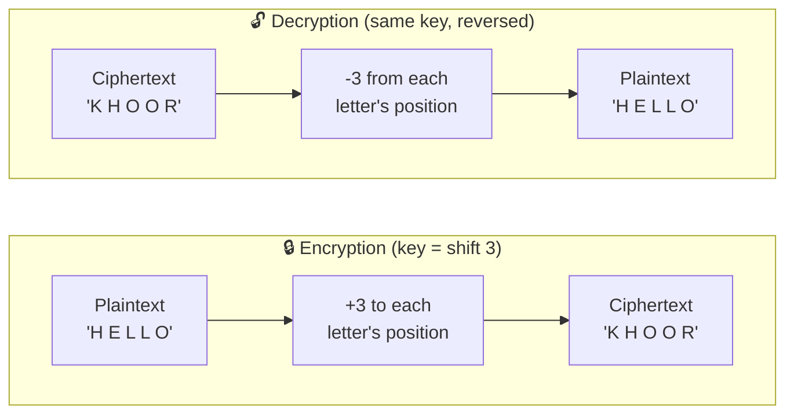
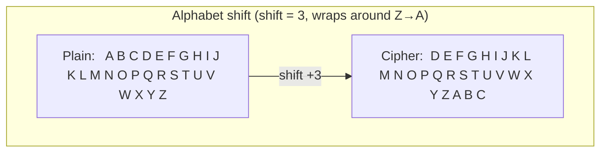
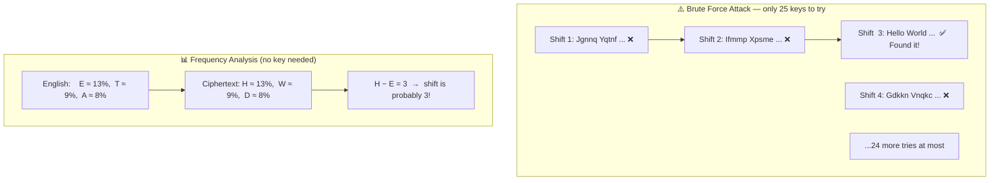
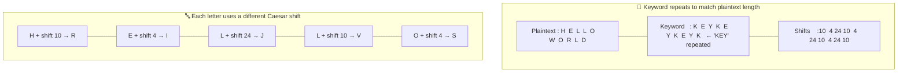
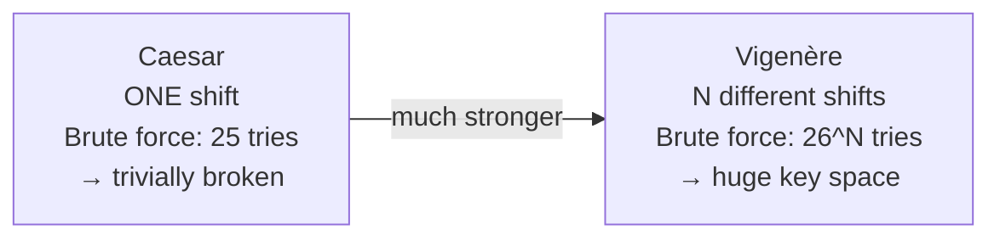
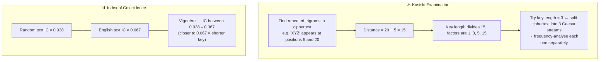

# Classical Ciphers

Pre-computer encryption based on letter substitution. Broken by modern standards, but essential for understanding the vocabulary of cryptography: plaintext, ciphertext, key, and attacks.

Run with:
```bash
mvn exec:java -Dexec.mainClass="security.encryption.classic.CaesarCipher"
mvn exec:java -Dexec.mainClass="security.encryption.classic.VigenereCipher"
```

---

## CaesarCipher.java

Each letter is shifted by a fixed number of positions in the alphabet. Named after Julius Caesar (~50 BCE). Only 25 possible keys — trivially broken.

### Encrypt / Decrypt



### Alphabet Shift



### Why It Fails — Attacks



---

## VigenereCipher.java

Uses a repeating keyword instead of one fixed shift — applying a different Caesar shift per letter. Considered unbreakable for 300 years, until Babbage cracked it in 1854.

### How the Keyword Works



### Caesar vs Vigenère



### How It Is Broken — Kasiski Examination


