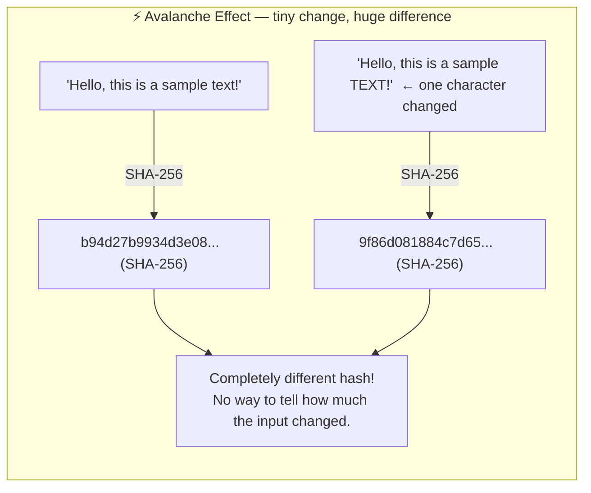
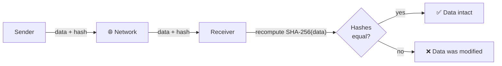
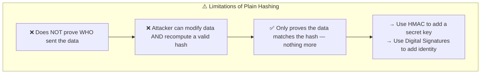
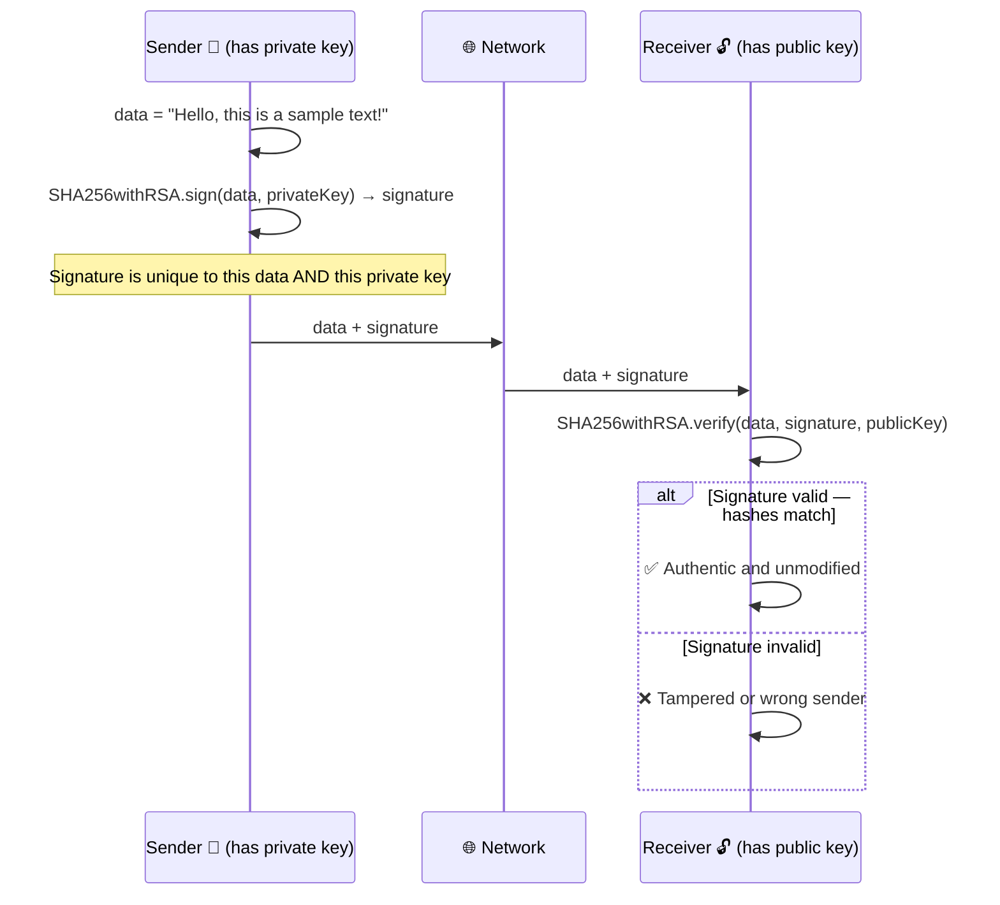
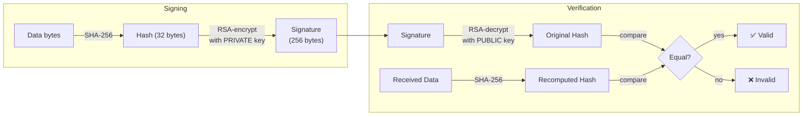
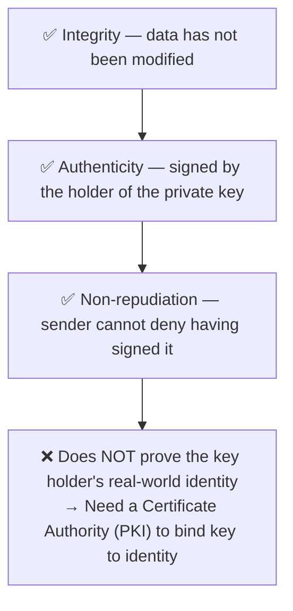
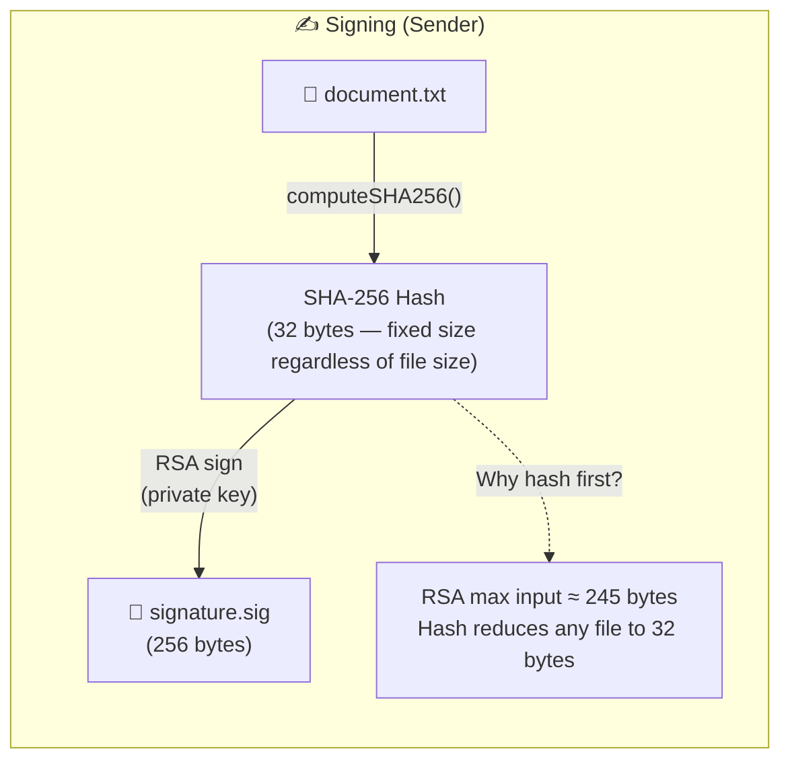
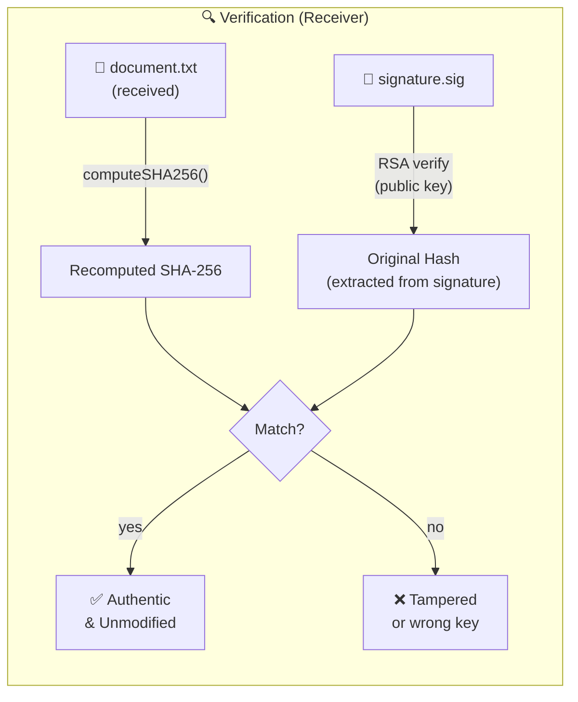
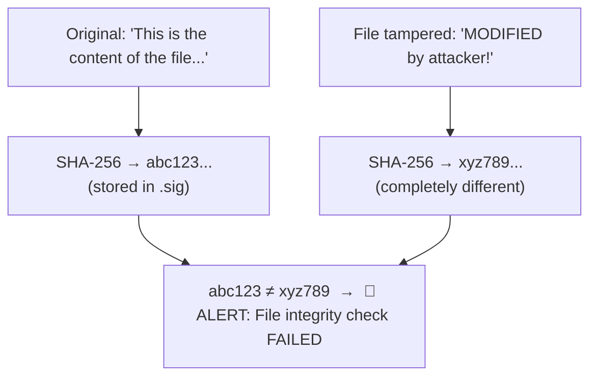

# Integrity & Digital Signatures

Three levels of integrity protection, each adding a new guarantee:

| Class | Mechanism | Guarantees |
|---|---|---|
| `IntegrityCheckHash` | SHA-256 hash | Data not modified in transit |
| `IntegrityCheckSignature` | RSA + SHA-256 | Data not modified **+** came from key owner |
| `FileDigitalSignature` | RSA + SHA-256 on files | Same, applied to files on disk |

Run with:
```bash
mvn exec:java -Dexec.mainClass="security.encryption.integrity.IntegrityCheckHash"
mvn exec:java -Dexec.mainClass="security.encryption.integrity.IntegrityCheckSignature"
mvn exec:java -Dexec.mainClass="security.encryption.integrity.FileDigitalSignature"
```

---

## IntegrityCheckHash.java

### Avalanche Effect



### Integrity Verification Flow



### What a Hash Does NOT Prove



---

## IntegrityCheckSignature.java

### Sign and Verify Sequence



### Under the Hood — SHA256withRSA



### What a Valid Signature Proves



---

## FileDigitalSignature.java

### Signing a File



### Verifying a File



### Tamper Detection Demo


