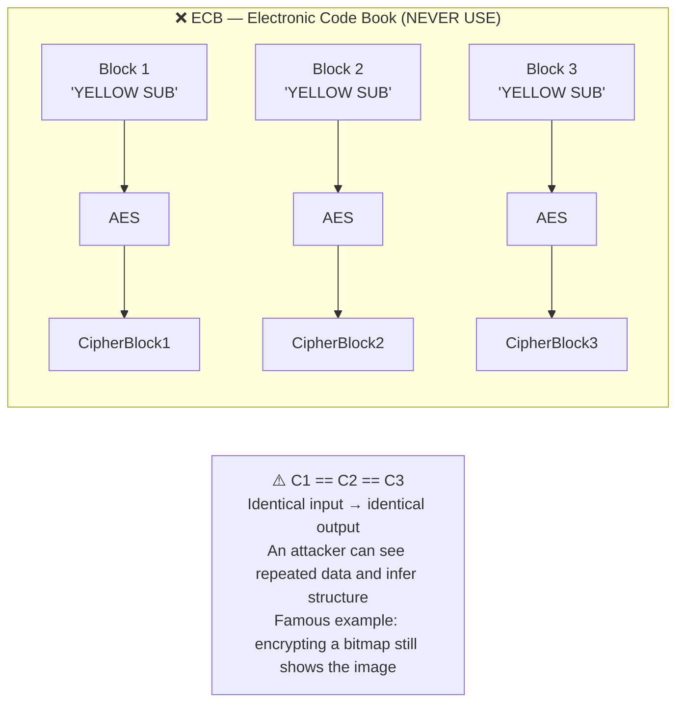
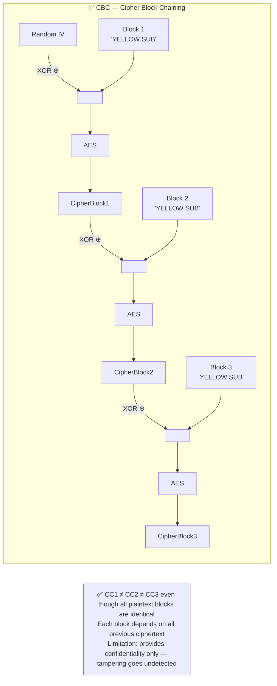
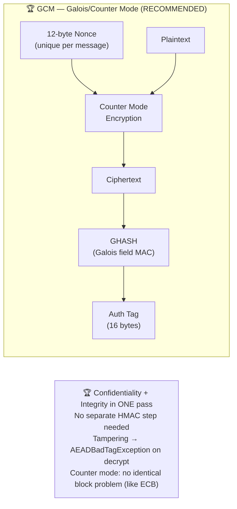
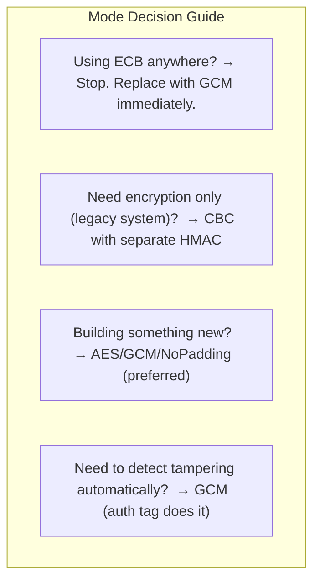

# Cipher Block Modes — ECB vs CBC vs GCM

AES encrypts exactly 16 bytes at a time. The **mode** determines how consecutive 16-byte blocks are connected. The algorithm is identical in all three — only the mode changes — but the security difference is dramatic.

Run with:
```bash
mvn exec:java -Dexec.mainClass="security.encryption.modes.CipherModesComparison"
```

---

## CipherModesComparison.java

### ECB — The Broken Mode



### CBC — Chains Blocks Together



### GCM — Encryption + Authentication in One Pass



### Mode Comparison Summary


