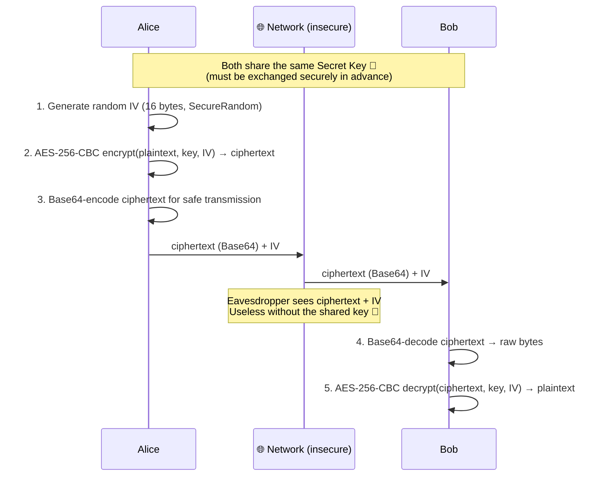
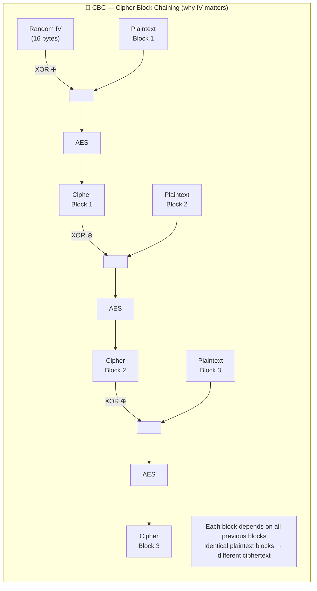

# Symmetric Encryption — AES-256-CBC

One key encrypts and decrypts. Fast enough for bulk data. The key distribution problem (how to share the key securely) is solved separately by key exchange protocols (see `security.keyexchange`).

Run with:
```bash
mvn exec:java -Dexec.mainClass="security.encryption.symmetric.SymmetricEncryptionExample"
```

---

## SymmetricEncryptionExample.java

### Alice → Bob Communication



### CBC Mode — How Blocks Are Chained



### Key and IV Facts

```mermaid
flowchart TD
    subgraph KeyFacts ["🔑 AES Key Facts"]
        KF1["256-bit key = 32 random bytes"]
        KF2["Generated by KeyGenerator — never hand-crafted"]
        KF3["Same key used for both encrypt AND decrypt<br/>(that is what 'symmetric' means)"]
        KF1 --- KF2 --- KF3
    end

    subgraph IVFacts ["🎲 IV (Initialization Vector) Facts"]
        IV1["16 bytes, cryptographically random per message"]
        IV2["NOT secret — sent alongside ciphertext"]
        IV3["Must be UNIQUE for every encryption"]
        IV4["Same plaintext + different IV = completely different ciphertext"]
        IV1 --- IV2 --- IV3 --- IV4
    end

    subgraph Base64 ["📝 Why Base64?"]
        B1["Encrypted bytes are raw binary (0–255)"]
        B2["Base64 encodes binary as printable ASCII"]
        B3["Safe for transmission in JSON, HTTP, email"]
        B1 --> B2 --> B3
    end
```


