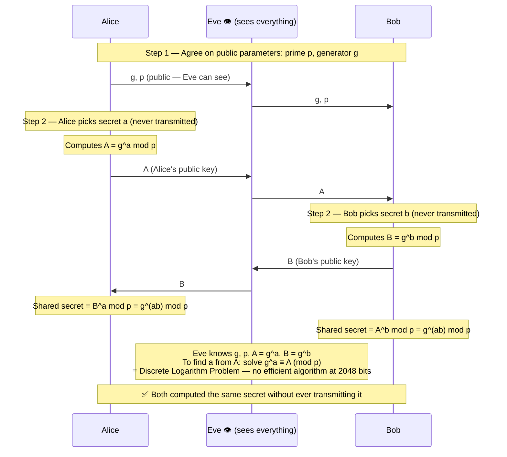
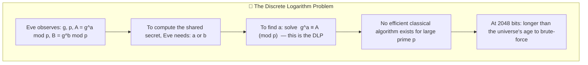
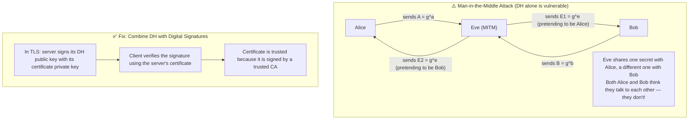
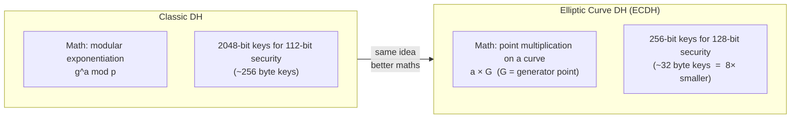
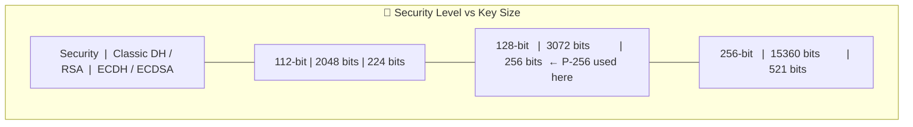
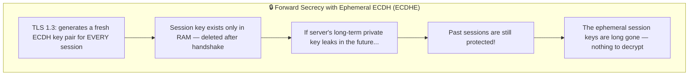

# Key Exchange Protocols

How do Alice and Bob agree on a shared secret when an eavesdropper can see every message? Key exchange protocols solve this through clever mathematics — the shared secret is never transmitted.

Run with:
```bash
mvn exec:java -Dexec.mainClass="security.keyexchange.DiffieHellmanExample"
mvn exec:java -Dexec.mainClass="security.keyexchange.ECDHExample"
```

---

## DiffieHellmanExample.java

### The Protocol — What Eve Sees vs What She Can Compute



### Why Eve Cannot Crack It



### Critical Limitation — No Authentication



---

## ECDHExample.java

### Classic DH vs Elliptic Curve DH



### Key Size Comparison



### Forward Secrecy — Why Ephemeral Keys Matter


