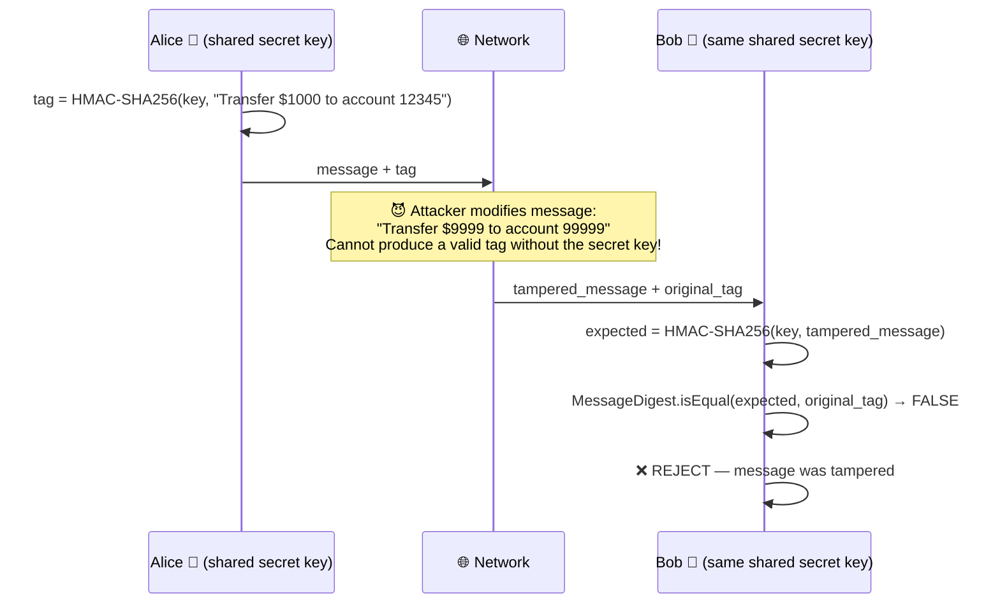
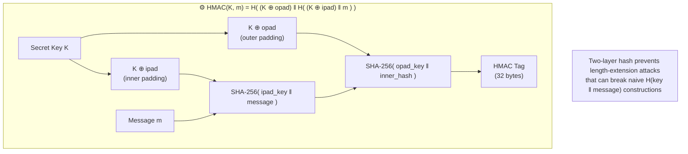
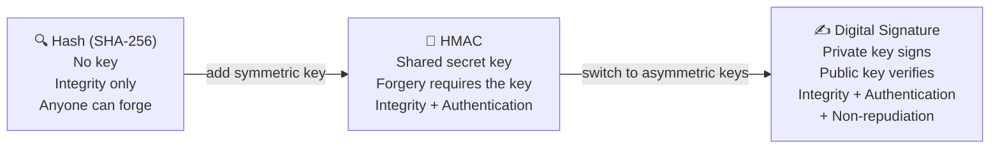
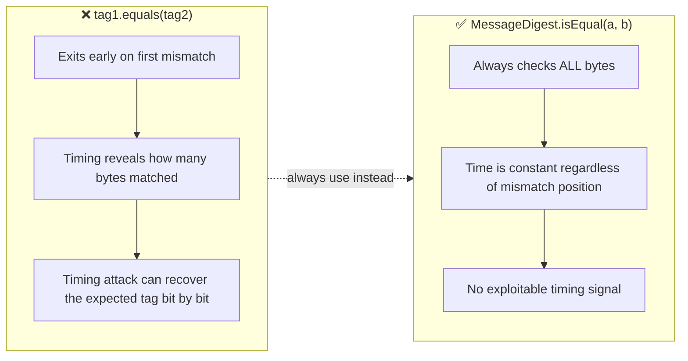

# MAC — Message Authentication Codes

HMAC (Hash-based Message Authentication Code) adds a **secret key** to hashing. Unlike a plain hash, only parties who hold the shared key can produce or verify the tag — proving both integrity and the sender's identity.

Run with:
```bash
mvn exec:java -Dexec.mainClass="security.mac.HMACExample"
```

---

## HMACExample.java

### Alice Sends a Message — Attacker Fails to Forge



### HMAC Construction — Why It's Secure



### Authentication Spectrum



### Constant-Time Comparison — Why It Matters


