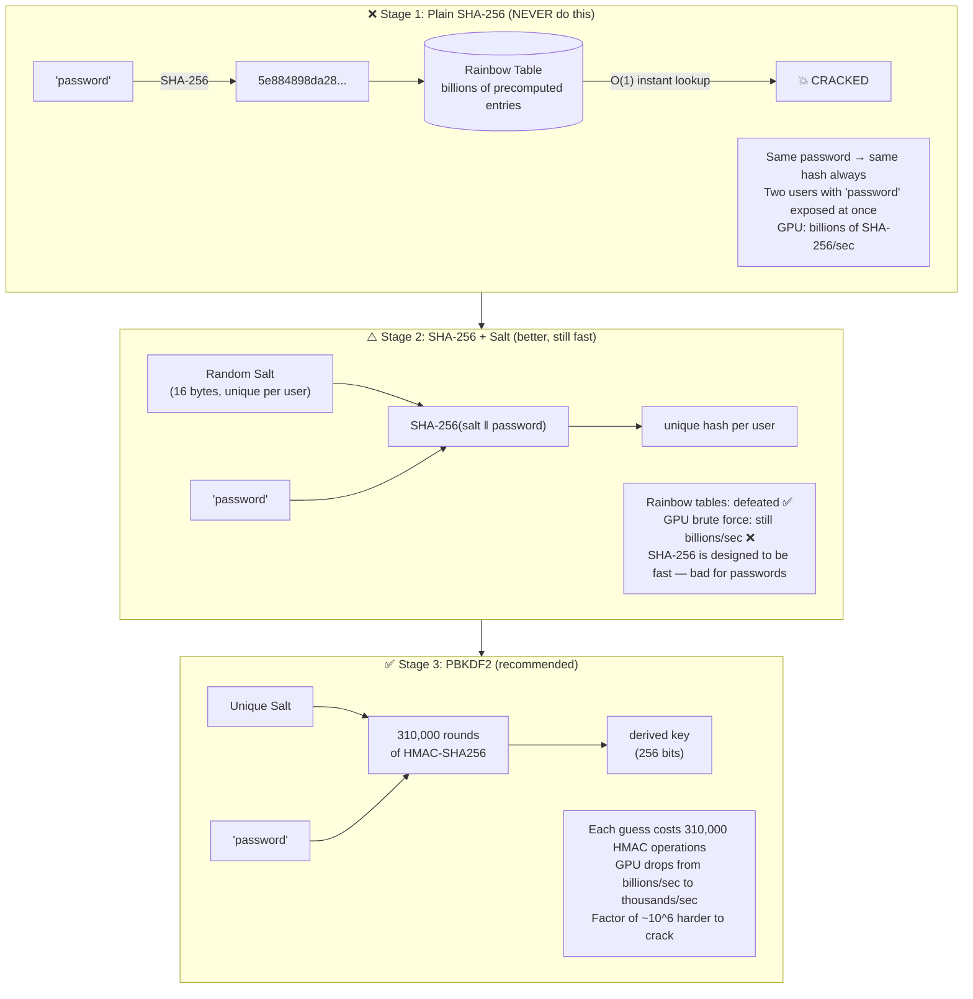
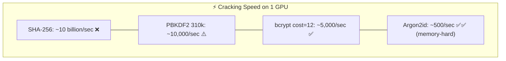
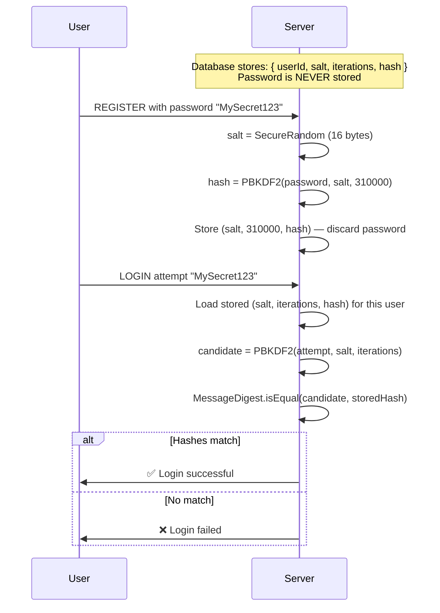
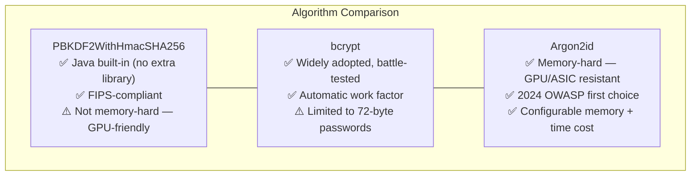

# Password Security

Passwords must never be stored as plain text or plain hashes. This package shows the evolution from completely insecure to production-ready password storage, and demonstrates why each step is necessary.

Run with:
```bash
mvn exec:java -Dexec.mainClass="security.passwords.PasswordHashingExample"
```

---

## PasswordHashingExample.java

### Stage Progression — Insecure to Secure



### Why SHA-256 Is Wrong for Passwords



### Login Verification Flow



### Algorithm Comparison


