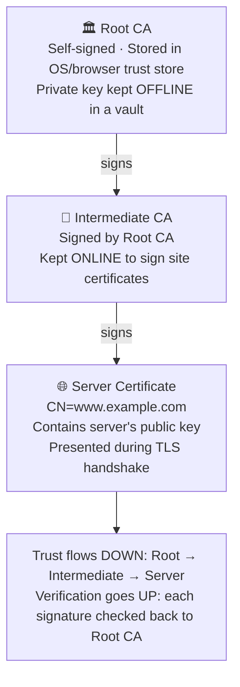
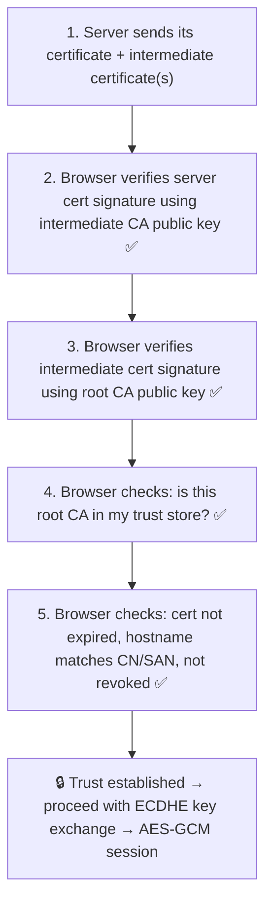
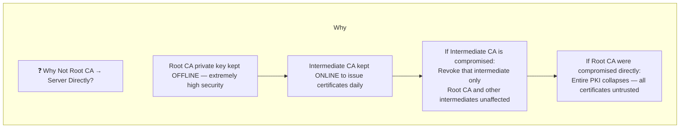
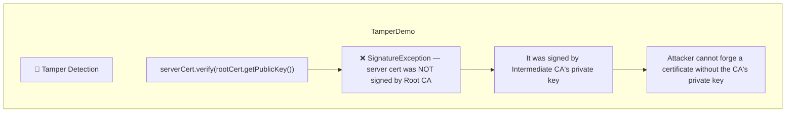
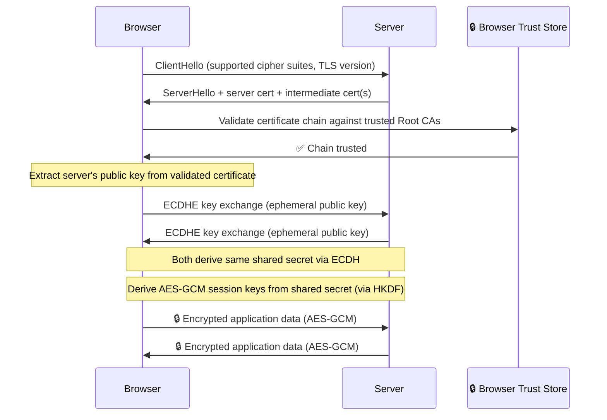
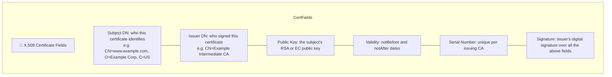

# PKI — Public Key Infrastructure

Public keys solve the encryption problem but create a new one: how do you know a public key actually belongs to `www.example.com` and not to an attacker? **Certificate Authorities** answer this by digitally signing certificates that bind a public key to an identity.

Run with:
```bash
mvn exec:java -Dexec.mainClass="security.pki.CertificateChainExample"
```

---

## CertificateChainExample.java

### The Certificate Chain of Trust



### Chain Validation — What the Browser Does



### Why Intermediate CAs Exist



### Tamper Detection — Demonstrated in Code



### TLS Handshake — Full Picture



### What an X.509 Certificate Contains


